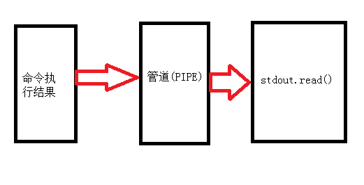

# subprocess模块

## subprocess

1、**call**

执行命令，返回状态码

```python
>>> import subprocess
>>> ret = subprocess.call(["ls", "-l"], shell=False)
total 4684
-rw-r--r-- 1 root root   454 May 5 12:20 aa.py
-rw-r--r-- 1 root root    0 May 8 16:51 aa.txt
-rw-r--r-- 1 root root 4783286 Apr 11 16:39 DockerToolbox.exe
-rw-r--r-- 1 root root   422 May 5 12:20 ip_info.txt
-rw-r--r-- 1 root root   718 Apr 19 10:52 my.cnf
>>> ret = subprocess.call("ls -l", shell=True)
total 4684
-rw-r--r-- 1 root root   454 May 5 12:20 aa.py
-rw-r--r-- 1 root root    0 May 8 16:51 aa.txt
-rw-r--r-- 1 root root 4783286 Apr 11 16:39 DockerToolbox.exe
-rw-r--r-- 1 root root   422 May 5 12:20 ip_info.txt
-rw-r--r-- 1 root root   718 Apr 19 10:52 my.cnf
>>> print(ret)
0
```

2、**check_call**

执行命令，如果执行状态码是 0 ，则返回0，否则抛异常

```Python
>>> subprocess.check_call(["ls", "-l"])
total 4684
-rw-r--r-- 1 root root   454 May 5 12:20 aa.py
-rw-r--r-- 1 root root    0 May 8 16:51 aa.txt
-rw-r--r-- 1 root root 4783286 Apr 11 16:39 DockerToolbox.exe
-rw-r--r-- 1 root root   422 May 5 12:20 ip_info.txt
-rw-r--r-- 1 root root   718 Apr 19 10:52 my.cnf
0
>>> subprocess.check_call("exit 1", shell=True)
Traceback (most recent call last):
 File "<stdin>", line 1, in <module>
 File "/usr/local/python3.5/lib/python3.5/subprocess.py", line 581, in check_call
  raise CalledProcessError(retcode, cmd)
subprocess.CalledProcessError: Command 'exit 1' returned non-zero exit status 1
```

3、**check_output**

执行命令，如果状态码是 0 ，则返回执行结果，否则抛异常

```python
>>> subprocess.check_output(["echo", "Hello World!"])
b'Hello World!\n'
>>> subprocess.check_output("exit 1", shell=True)
Traceback (most recent call last):
 File "<stdin>", line 1, in <module>
 File "/usr/local/python3.5/lib/python3.5/subprocess.py", line 626, in check_output
  **kwargs).stdout
 File "/usr/local/python3.5/lib/python3.5/subprocess.py", line 708, in run
  output=stdout, stderr=stderr)
subprocess.CalledProcessError: Command 'exit 1' returned non-zero exit status 1
```

4、**run**

返回一个CompletedProcess实例

```Python
>>> subprocess.run(["ls", "-l"]) # doesn't capture output
CompletedProcess(args=['ls', '-l'], returncode=0)

>>> subprocess.run("exit 1", shell=True, check=True)
Traceback (most recent call last):
...
subprocess.CalledProcessError: Command 'exit 1' returned non-zero exit status 1

>>> subprocess.run(["ls", "-l", "/dev/null"], stdout=subprocess.PIPE)
CompletedProcess(args=['ls', '-l', '/dev/null'], returncode=0,
stdout=b'crw-rw-rw- 1 root root 1, 3 Jan 23 16:23 /dev/null\n')
```

5、**getstatusoutput**

接受字符串形式的命令，返回 一个元组形式的结果，第一个元素是命令执行状态，第二个为执行结果

```Python
#执行正确
>>> subprocess.getstatusoutput('pwd')
(0, '/root')
#执行错误
>>> subprocess.getstatusoutput('pd')
(127, '/bin/sh: pd: command not found')
```

6、**getoutput()**

接受字符串形式的命令，返回执行结果

```Python
>>> subprocess.getoutput('pwd')
'/root'
```


## **subprocess.Popen(...)**

1、stdout

标准输出

```Python
>>> res = subprocess.Popen("ls /tmp/yum.log", shell=True, stdout=subprocess.PIPE) # 使用管道
>>> res.stdout.read()  # 标准输出
b'/tmp/yum.log\n'
res.stdout.close()  # 关闭
```

2、stderr

标准错误

```Python
>>> import subprocess
>>> res = subprocess.Popen("lm -l",shell=True,stdout=subprocess.PIPE,stderr=subprocess.PIPE)
# 标准输出为空
>>> res.stdout.read()
b''
#标准错误中有错误信息
>>> res.stderr.read()
b'/bin/sh: lm: command not found\n'
```

**注意：上面的提到的标准输出都为啥都需要等于subprocess.PIPE,这个又是啥呢？原来这个是一个管道，这个需要画一个图来解释一下：**



3、poll

定时检查命令有没有执行完毕，执行完毕后返回执行结果的状态，没有执行完毕返回None

```python
>>> res = subprocess.Popen("sleep 10;echo 'hello'",shell=True,stdout=subprocess.PIPE,stderr=subprocess.PIPE)
>>> print(res.poll())
None
>>> print(res.poll())
None
>>> print(res.poll())
0
```

4、wait

等待命令执行完成，并且返回结果状态

```Python
>>> obj = subprocess.Popen("sleep 10;echo 'hello'",shell=True,stdout=subprocess.PIPE,stderr=subprocess.PIPE)
>>> obj.wait()
# 中间会一直等待
0
```

5、terminate

结束进程

```Python
import subprocess
>>> res = subprocess.Popen("sleep 20;echo 'hello'",shell=True,stdout=subprocess.PIPE,stderr=subprocess.PIPE)
>>> res.terminate() # 结束进程
>>> res.stdout.read()
b''
```

6、pid

获取当前执行子shell的程序的进程号

```Python
import subprocess
>>> res = subprocess.Popen("sleep 5;echo 'hello'",shell=True,stdout=subprocess.PIPE,stderr=subprocess.PIPE)
>>> res.pid # 获取这个linux shell 的 进程号
2778
```

